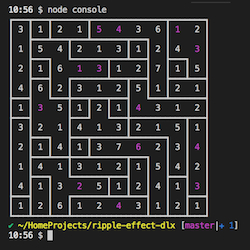

# Description

Solve Ripple Effect puzzles using Donald E. Knuth's DLX.

## Details of the DLX Matrix

> Most of the following description is copied from
[RippleEffectDlx](https://github.com/taylorjg/RippleEffectDlx) with a few modifications.

### Primary columns

* One primary column per position (row/col) in the grid.
These primary columns ensure that the grid is fully populated
i.e. every position in the grid is filled exactly once.
Total number of these columns: `width * height`.

* One primary column for each value in each room.
These primary columns ensure that every room is fully populated
and that there are no duplicate values in a room. For example,
a room with four cells must contain one each of 1, 2, 3 and 4.
Total number of these columns: `width * height`.

### Secondary columns

Secondary columns are used to enforce the proximity constraints.
There are four sets of secondary columns for each number from 1 to the largest room size.
For example, if the largest room size is 5, there will be 4 x 5 = 20 sets of secondary columns.
A set of four secondary columns represents the ripple of a placed digit in each direction - 
up, down, left and right.
I think of this as reserving space around the placed digit in each direction.
There are
four sets of secondary columns for placed 1s,
four sets of secondary columns for placed 2s,
etc.
The number of columns in each set of secondary columns is `width * height`.

This is best explained using an example. Say we have a 5x5 grid with
position (0,0) at top left. Lets say that we have placed a 2 at (1,1):

```
-----
-2---
-----
-----
-----
```

The first set of secondary columns represents the position of the 2 itself plus
the positions above that must not contain another 2 (one of these lies off the top of the grid):

```
-x---   (01000)
-x---   (01000)
-----   (00000)
-----   (00000)
-----   (00000)

0100001000000000000000000
```

The second set of secondary columns represents the position of the 2 itself plus
the positions below that must not contain another 2:

```
-----   (00000)
-x---   (01000)
-x---   (01000)
-x---   (01000)
-----   (00000)

0000001000010000100000000
```

The third set of secondary columns represents the position of the 2 itself plus
the positions to the left that must not contain another 2 (one of these lies off the left of the grid):

```
-----   (00000)
xx---   (11000)
-----   (00000)
-----   (00000)
-----   (00000)

0000011000000000000000000
```

The fourth set of secondary columns represents the position of the 2 itself plus
the positions to the right that must not contain another 2:

```
-----   (00000)
-xxx-   (01110)
-----   (00000)
-----   (00000)
-----   (00000)

0000001110000000000000000
```

In any given row of the DLX matrix, which represents the placement of a single digit,
only four sets of secondary columns are relevant.
All other sets of secondary columns will contain 0s.
Hence, the DLX matrix is very sparse.

As an extremely simplified example, if we have a 3x3 grid where the largest room size is 2,
then we will have 4 sets of secondary columns for 1s and 4 sets of secondary columns for 2s.
So, our placement of a 2 at (1,1) on a 3x3 grid would have secondary columns like this:

| U,D,L,R sets for 1s | U,D,L,R sets for 2s |
| ------------------- | ------------------- |
| 000000000 000000000 000000000 000000000 | 010010000 000010010 000110000 000011000 |

The final number of columns in the DLX matrix is `(2 + 4 * largest room size) * width * height`.
For example, an 8x8 puzzle with a largest room size of 5 will result in a DLX matrix with
`(2 + 4 * 5) * width * height` = `22 * 64` = `1408` columns.

# TODO

* ~~Stop using local copy of dlxlib~~
  * ~~Now using dlxlib@next which has support for secondary columns~~
* Add checkbox re whether to animate the solution
* Add slider to control speed of animation
* Add more puzzles
  * Use a simpler format
  * Encode more puzzles
* Responsive UI  

# Screenshots

## Console App



## Web App

Try it out - it is deployed [here](https://taylorjg.github.io/ripple-effect-dlx/).

# Links

* http://www.nikoli.co.jp/en/puzzles/ripple_effect.html
* https://krazydad.com/ripple/
* https://arxiv.org/pdf/cs/0011047v1.pdf
* https://www-cs-faculty.stanford.edu/~knuth/fasc5c.ps.gz
* https://www.npmjs.com/package/dlxlib
